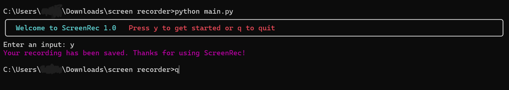
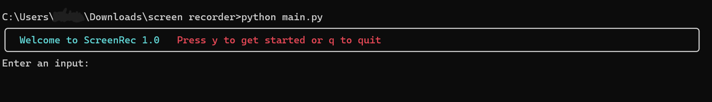

Don't pay for an essential functionality, screen record to your heart's content with ScreenRec - a CLI tool with a pretty cool interface and you need only 2 options to navigate the tool - a 'q' to quit and a 'y' to start.

